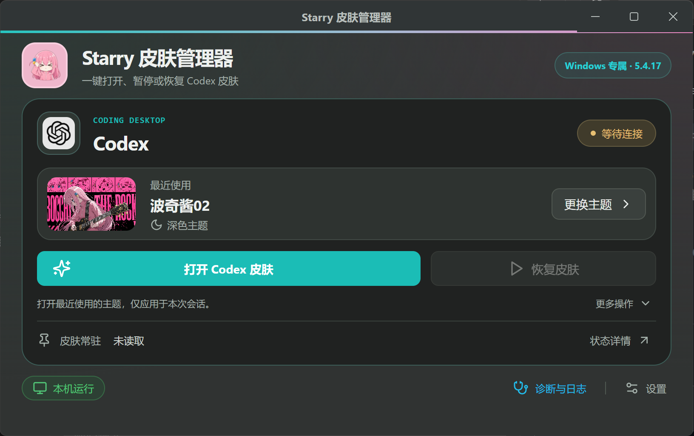

# Starry 皮肤管理器

适用于 Windows Codex 桌面端的皮肤管理工具。这个公开仓库提供安装包、使用说明与问题反馈。

<a id="install-with-codex"></a>

## 让 Codex 帮你安装

可以把**这个仓库的链接和一句安装要求**发给能操作目标 Windows 电脑的 Codex。无需自己下载源码或配置 Node.js。

直接复制下面整段：

```text
请按照这个仓库 README 中“让 Codex 帮你安装”的说明，在这台 Windows 电脑上安装并启动 Starry 皮肤管理器：
https://github.com/starryxxx5233-netizen/starry-skin-manager-releases

请先读取 docs/INSTALL_WITH_CODEX.md，下载说明中指定版本的整合包，校验 SHA-256，解压到固定目录、安装随包的 HeiGe 制作皮肤 Skill，并创建桌面快捷方式。已有版本和配置先备份，保留自定义主题。实际验证启动、主题加载和窗口大小记忆，告诉我安装位置及验证结果。需要重启 Codex 时先让我确认。
```

也可以只发送仓库链接，再说：**“按照 README 的 Codex 安装说明，帮我安装并验证运行。”**

前提是 Codex 能在这台电脑上执行本地操作，并能访问 GitHub、写入安装目录；单纯打开网页或在未连接本机的云端聊天中粘贴地址，不能完成本机安装。出现实际权限提示时按提示处理，无需预先关闭所有权限限制。相关能力由 [Codex 的运行环境与权限](https://learn.chatgpt.com/docs/sandboxing) 决定。

当前安装目标是 **0.4.0-beta.2 公开测试版，仅提供 Windows x64 分发包**。[详细安装步骤与验收要求](docs/INSTALL_WITH_CODEX.md)供 Codex 执行时参考；如果不能执行某一步，应说明原因和需要用户完成的操作。

## 下载

**[下载 0.4.0-beta.2 公开测试版](https://github.com/starryxxx5233-netizen/starry-skin-manager-releases/releases/tag/v0.4.0-beta.2)**

- `Starry-Skin-Manager-0.4.0-beta.2-Setup.exe`：Windows x64 整合安装程序；安装后按下方步骤注册 Skill。
- `Starry-Skin-Manager-0.4.0-beta.2-Windows-x64.zip`：完整文件夹整合版，包含管理器、引擎、Node.js、12 款主题与 HeiGe 制作皮肤 Skill。请勿单独移动 EXE。
- `Starry-HeiGe-Skill-0.4.0-beta.2.zip`：已有管理器的 Skill 修复补充包；旧版用户建议直接升级整合包。
- `SHA256SUMS.txt`：以上三个下载文件的校验值。

使用前需要安装 **Codex 桌面端**。分发包包含兼容皮肤引擎 5.4.17、Node.js 24.16.0、12 款内置主题与 HeiGe 制作皮肤 Skill（Starry Windows 适配版），无需另外安装 Node.js 或手动下载引擎。管理器版本与右上角显示的引擎版本分别管理。

GitHub 自动生成的 **Source code (zip)** 只是本下载页的文件，不是软件安装包。

## 制作皮肤 Skill

**0.4.0-beta.1 漏打包了 Skill；0.4.0-beta.2 已补齐。** 管理器和 Skill 是两部分：有引擎可以运行管理器，但要让 Codex 按技能制作皮肤，还需要注册 Skill。

安装或解压后，在程序目录双击 **`安装制作皮肤Skill.cmd`**，也可以让 Codex 按 [完整安装说明](docs/INSTALL_WITH_CODEX.md#注册制作皮肤-skill) 执行。已有同名 Skill 会先备份，再安装本包的 Windows 适配版本；不会自动应用皮肤或重启 Codex。

下一条消息可对 Codex 说：**“使用 heige-codex-skin-studio，把这张图片制作成皮肤，先只制作。”** 若技能列表未刷新，新建对话再试。Skill 与管理器使用同一包内引擎和用户主题目录；管理器重开后可看到新主题。

**旧版用户建议升级完整整合包**：beta.2 还修复了“跟随系统”主题被旧管理器隐藏的问题。补充包可修复 Skill 文件，但不能替代管理器程序升级。

## 界面预览



截图由项目所有者提供，保留原图。“波奇酱02”为截图中的自定义主题，不包含在默认的 12 款主题中。

## 使用

1. 下载并安装，或将完整 ZIP 解压到固定目录。
2. 打开 Starry 皮肤管理器，点击“更换主题”选择喜欢的主题。
3. 点击“打开 Codex 皮肤”。如果当前 Codex 需要重新打开才能连接，管理器会先提示确认；请先保存正在进行的工作。
4. 在主题页可搜索、分页并拖拽卡片；跨页移动后松手即保存顺序。
5. 调整窗口大小与位置，下次启动会恢复。关闭窗口会进入托盘；需要完全退出时使用托盘菜单。

安装过程不会自动启用皮肤常驻。卸载前建议在管理器中恢复原生界面并关闭常驻；文件夹版启用常驻后请勿直接移动其目录。

## 测试版说明

本版本已通过 75 项自动化测试与 11 项实际打包程序检查，详细范围见 [验证记录](VALIDATION.md)。尚未完成另一台干净 Windows 电脑的安装、卸载，以及真实 Codex 的应用、暂停、恢复、恢复原生完整流程验证；Microsoft Store/MSIX 全路径也未完成验证。

遇到问题可通过本仓库 [Issues](https://github.com/starryxxx5233-netizen/starry-skin-manager-releases/issues) 提供 Windows / Codex 版本、安装渠道、操作步骤和报错。请勿上传账号凭据或未经检查的私人日志。

## 来源与许可

基于 [HeiGe Codex Skin Studio](https://github.com/HeiGeAi/heige-codex-skin-studio) 的定制版本，保留原项目软件代码许可与声明。Starry 主要调整管理器界面、主题排列、窗口行为与 Windows 打包方式。

第三方软件许可随分发包提供。代码许可不自动覆盖角色图片、图标与商标；原项目视觉素材记录见 [第三方声明](NOTICE.md) 和 [素材来源](ASSET_PROVENANCE.md)。截图与管理器角色图标由项目所有者提供，不另行宣称第三方授权。

本项目为非官方工具，与 OpenAI 不存在隶属或背书关系。
